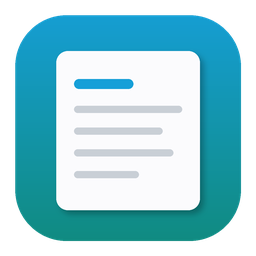

# Simple Notepad



A lightweight, fast‑starting notepad for Windows. Native **WPF + .NET 8**, built around
**sessions** (like chat threads) instead of files — every note autosaves, lives in a
left‑hand list, and quietly expires after 7 days of inactivity unless you pin it.

<br clear="left" />


It also includes the things a notepad usually makes you reach for another tool to do:
inline **find & replace**, automatic **JSON formatting with syntax colors**, an optional
**AI rewrite** button, and optional **multi‑device cloud sync** via Azure Blob storage.

---

## Features

- **Session sidebar** — notes are organized as sessions you can rename, pin, and reopen.
  Unpinned sessions auto‑expire 7 days after they were last touched; pinned ones stay forever.
- **Autosave** — content and titles are saved continuously in the background. No "unsaved
  changes" anxiety.
- **Find & Replace** — inline bar with match navigation (`Ctrl+F`).
- **JSON tooling** — paste JSON and it's detected and pretty‑printed with **syntax coloring**.
  Format on demand with `Ctrl+Shift+F` (selection or whole document).
- **Linked PowerShell** — run linked PowerShell snippets from your notes.
- **AI Rewrite** *(optional)* — select text, hit **Rewrite**, preview the suggestion, tweak the
  instruction, regenerate, and replace only if you're happy. Can also **generate a title** for an
  untitled session. Powered by **Azure OpenAI**; your API key is encrypted at rest with Windows DPAPI.
- **Cloud sync** *(optional)* — mirror your sessions across machines through a private **Azure Blob**
  container. Uses a **per‑device ownership** model: each device only writes its own notes and sees
  other devices' notes as **read‑only, color‑coded mirrors** — so there are *no merge conflicts*.
  "Duplicate to edit" forks a mirror into a note you own. Connection string is DPAPI‑encrypted.
- **Theming** — Dark and Light themes, adjustable font size (`Ctrl +` / `Ctrl -` / `Ctrl 0`),
  word wrap, and a resizable sidebar. Window size/position are remembered.
- **Lightweight & fast** — no Electron, no background services; the cloud/AI SDKs are only loaded
  when you actually use those features, so startup stays snappy.

---

## Keyboard shortcuts

| Action | Shortcut |
| --- | --- |
| Find & Replace | `Ctrl+F` |
| Format JSON (selection or document) | `Ctrl+Shift+F` |
| New session | `Ctrl+N` |
| Open file as session | `Ctrl+O` |
| Save | `Ctrl+S` |
| Save As | `Ctrl+Shift+S` |
| Increase / decrease font | `Ctrl +` / `Ctrl -` |
| Reset font size | `Ctrl+0` |

---

## Install / run

### Option A — Download the prebuilt EXE (easiest)
Grab `SimpleNotepad.exe` from the [latest release](../../releases/latest) and run it.
It's a **self‑contained** build — no .NET install required. Windows SmartScreen may warn on an
unsigned exe; choose **More info → Run anyway**.

### Option B — Download the installer (Start‑menu entry + uninstall + auto‑upgrade)
Grab `SimpleNotepad-Setup-<version>.exe` from the [latest release](../../releases/latest). It installs
to *Program Files*, adds Start‑menu/Desktop shortcuts, and registers an entry under
**Apps & features** so you can uninstall cleanly. Running a newer setup over an existing install
upgrades it **in place** (it closes a running instance first). The installer can optionally collect
your AI/sync credentials — see [Provisioning credentials](#provisioning-credentials-through-the-installer).

### Option C — Build from source
Requires the [.NET 8 SDK](https://dotnet.microsoft.com/download/dotnet/8.0).

```powershell
git clone https://github.com/devesh1102/simple-notepad.git
cd simple-notepad
dotnet run --project .\SimpleNotepad\SimpleNotepad.csproj -c Release
```

Produce your own self‑contained single‑file exe:

```powershell
dotnet publish .\SimpleNotepad\SimpleNotepad.csproj -c Release -r win-x64 --self-contained true `
  -p:PublishSingleFile=true -p:IncludeNativeLibrariesForSelfExtract=true -o .\artifacts\exe-test
```

An [Inno Setup](https://jrsoftware.org/isinfo.php) script is also provided to produce a per‑machine
installer:

```powershell
dotnet publish .\SimpleNotepad\SimpleNotepad.csproj -c Release -r win-x64 --self-contained true -o .\artifacts\app-folder
"C:\Program Files (x86)\Inno Setup 6\ISCC.exe" installer\SimpleNotepad.iss
```

---

## Where your data lives

All notes and settings are stored locally under:

```
%LOCALAPPDATA%\SimpleNotepad\
  ├─ sessions\               # one .txt per session
  ├─ sessions.index.json     # session list + metadata
  └─ settings.json           # theme, font, window, AI & sync config
```

Secrets (Azure OpenAI API key, sync connection string) are stored **encrypted** via Windows DPAPI,
scoped to your Windows user account.

---

## Optional setup

All AI and sync configuration lives in one place: click the **⚙ Settings** button (top of the
sessions sidebar) to open the unified settings dialog. Leave a section blank to keep that feature
turned off. Secrets are encrypted at rest with Windows DPAPI, scoped to your Windows user account.

### AI Rewrite (Azure OpenAI)
In **⚙ Settings → AI Rewrite**, provide your Azure OpenAI **endpoint** (HTTPS), **deployment** name,
and **API key**. Use **Test AI connection** to verify, then save. Select text and click **Rewrite**
to preview/replace.

### Cloud sync (Azure Blob)
In **⚙ Settings → Cloud Sync**, provide a storage **connection string**, a **container** name, and a
**device name / color**. Click **Test sync connection**, save, then **Sync**. Each device owns the
notes it creates; other devices appear as read‑only mirrors you can duplicate to edit.

> Note: explicitly deleting a note removes it everywhere; letting a note expire locally (7‑day rule)
> does **not** delete it from the cloud or from your other devices.

### Provisioning credentials through the installer
The installer can optionally collect your AI and sync credentials during setup. They are written to a
short‑lived plaintext file under `%PROGRAMDATA%\SimpleNotepad`, which the app imports on first run —
re‑encrypting the secrets under your user account (DPAPI) and then deleting the plaintext file.

---

## Tech stack

- **WPF** on **.NET 8** (`net8.0-windows`)
- [AvalonEdit](https://github.com/icsharpcode/AvalonEdit) for the editor + JSON syntax highlighting
- [Azure.AI.OpenAI](https://www.nuget.org/packages/Azure.AI.OpenAI) for AI rewrite
- [Azure.Storage.Blobs](https://www.nuget.org/packages/Azure.Storage.Blobs) for cloud sync
- Windows **DPAPI** (`ProtectedData`) for secret encryption

---

## License

MIT — see [LICENSE](LICENSE).
